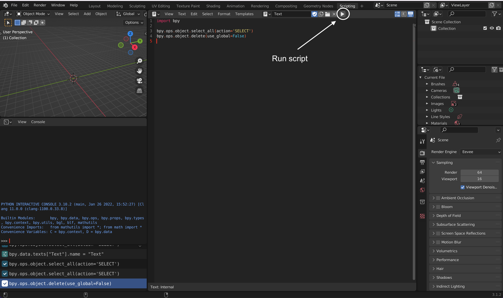

Developer's Guide
=================

We welcome everyone who is interested in creating 3D models of biological stem cells on Blender!

The developer's guide is to help contributors on how to start working and contributing 
on Goo. If you are interested in join, please contact Sean Megason on his email address. sean.megason(AT)hms.harvard.edu.

Git/Github
----------

The first thing you need to do is to fork Goo repository and then clone the forked repository into your local machine. This 
Will give you the freedom to test and make changes to the project without affecting the original repository. 

Make sure you have git installed on your local machine.  If you do not have it install on your system, refer to this guide: https://github.com/git-guides/install-git

Fork & clone
~~~~~~~~~~~~~~

If you are new to Git/Github, here is detailed info on how to fork and clone a repository from Github:
https://docs.github.com/en/get-started/quickstart/fork-a-repo

Push
~~~~~~

Once you make final changes and the scripts run with no issues, you can push them into the main project. Here_ is an instruction on how to push using git.

.. _Here: https://docs.github.com/en/get-started/importing-your-projects-to-github/importing-source-code-to-github/adding-locally-hosted-code-to-github 

Blender 
-------

Blender is an open source 3D computer software. It is free to download_. Blender has a huge community and contributors all over the world. You may find Python API_ for Blender very useful.  

.. _download: https://www.blender.org/download/
.. _API: https://docs.blender.org/api/current/index.html

Once you have downloaded and installed Blender, launch Blender and select *General* for the new file. **Scripting** tab allows you to interact with Blender using Python language. By clicking **scripting**, a list of windows will open:

- *3D Viewport* allows you to interact with 3D objects.
- *Python Interactive Console* allows you to interact with Blender using Python language. 
- *Info Console Menu* or *Report console* creates a log in Python of the executed actions on Blender. In another words, it translates the clicks you made in Blender into code. This is very useful especially when you try to automate procedures of actions on *scripting*.    

.. image:: ../img/basic_blender.png
  :width: 800

Creating Python File
~~~~~~~~~~~~~~~~~~~~

You can create a Python file and run it on Blender. Once you are in **Scripting** tab, click on the *+ New* icon. 

.. image:: ../img/python_file.png
  :width: 800

*bpy* is a Blender API that allow to interact with Blender through Python language. To import Blender API, you write the following::
    import bpy

The Blender API can used with no installation nor importing into the Python Interactive Console. The Python file can be run on Blender by clicking on *play* icon. 

Viewing Python Error Messages
~~~~~~~~~~~~~~~~~~~~~~~~~~~~~

**PC**: *Window -> Toggle System Console*

**Mac**: *Finder -> Applications -> right-click on Blender -> Show Package Content -> Contents -> MacOS -> right-click on Blender -> Make Alias*. Blender will be launched by double-clicking the Blender alias and any error messages will display on the alias window. You can store the alia any folder. 

Blender Python Tutorials
~~~~~~~~~~~~~~~~~~~~~~~~

You can  find many free tutorials on YouTube and the Internet. here is a great tutorial, made by Darkfall_, on YouTube on how to write a Python script in Blender. 

.. _Darkfall: https://www.youtube.com/watch?v=cyt0O7saU4Q&list=PLFtLHTf5bnym_wk4DcYIMq1DkjqB7kDb-&ab_channel=Darkfall

Useful Blender Tips
~~~~~~~~~~~~~~~~~~~

- To Display *Line Numbers* on a Python file, click *View* and mark the checkbox of *Line Numbers*. *View* tab will appear once you create a Python file.
- To turn on *Highlight Line* at the line currently at, click *View* and mark the checkbox of *Highlight Line*. *View* tab will appear once you create a Python file.
- *Developer Extras* allows users to examine Python codes on any features or buttons on Blender by right-clicking for example on a Render button and then select *Edit Source*.  To enable this *Developer Extras*, go to *Edit* -> *Preferences* -> *Interface* -> check *Developer Extras*
- *Python Tooltips* also allows users to examine the Python codes behind any bulit-in Blender features by just hovering the mouse on top and a pops-up window will appear.  To enable *Python Tooltips*, *Edit* -> *Preferences* -> *Interface* -> Check *Python Tooltips*

Visual Studio Code (VSCode) 
---------------------------

You can use any IDE softwares (Atom, PyCharm, Anaconda,...etc) available on the internet, but from our experience Visual Studio Code has been very smooth and convenient to use. 

Getting started with VSCode:
~~~~~~~~~~~~~~~~~~~~~~~~~~~~

#. **Install Python** - Make sure you have Python already installed in your machine. If you are not sure, you can check by typing "python --version" on Terminal/Command Window.  If it returns python with some numbers, then you know Python already was installed.  But if it does not, you need install `Python <https://www.python.org/downloads/>`_.
#. **Install Blender API** - Open Terminal/Command Window and type "*pip install fake-bpy-module-latest*".  This command line will install the latest Blender's version available using Pip package manager. For more info on visit `Fake Blender Github <https://github.com/nutti/fake-bpy-module>`_.
#. **Download and install VSCode software** - `Visual Studio Code <https://code.visualstudio.com/download>`_. 
#. **Install Python extension** - open VSCode and go to the extension tab and search for "Python" by Microsoft. The VSCode extensions enhance developer's experience. 
#. **Install Blender extenion** - same as before open up VSCode and got to extension and search for "Blender Development" by Jacques Lucke
#. **Open Goo folder in VSCode** - *File > Open Folder* (See **Git/GitHub** section on how to clone Goo on your local machine if you have not done it yet).
#. **Enable and Select Linter** - Before you start working on Goo, you need to enable Linter which advise you about the code quality.  We are following fake8 style. To enable linter in VSCode, hit *ctl + shift + P* and type "Python: Enable/Disable Linting".  Click on it and enable it. Now you need to select the code style.  Again click *ctl + shift + P* and type "Python: Select Linter" and then select *fake8*
#. **Open Terminal** - if needed, you can open Terminal in VSCode. Go to Terminal tab and then select New Terminal. 

Developing Python codes for Blender in VSCode
~~~~~~~~~~~~~~~~~~~~~~~~~~~~~~~~~~~~~~~~~~~~~

We have already shown how to run Python codes in Blender (see *Creating Python file* above). In this section, we will show you how to run Python scripts on VSCode written exclusively for Blender.

#. **Python file**: Create a Python file in VSCode. 
#. **Link Blender executable file**: Click *ctl + shift + p* , select *Blender: Start*, and then select the executable Blender (you can find it in Blender folder). In *Mac*:  Finder > Application > right-click on Blender and choose "Show Package Content" > Contents > MacOS. In *PC*: find the path where blender.exe exists in Blender folder. Once you link the executable, Blender will launch.  Select *General* to start from scratch.  
#. **Run Python script**: if you want to run your script, hit *ctl + shift + p* and select *Blender: Run Script*. Now, you can see the results in Blender.

